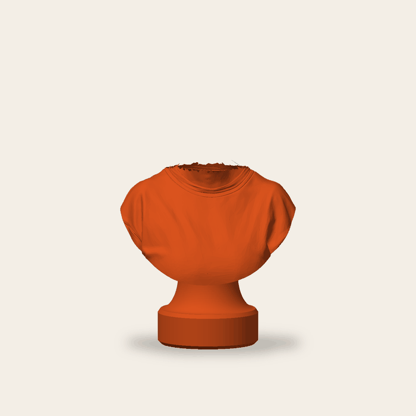
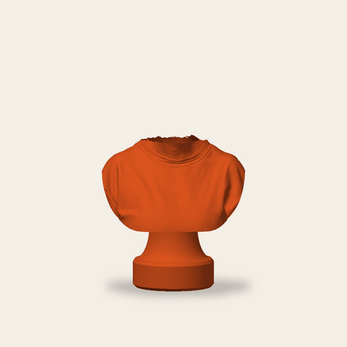
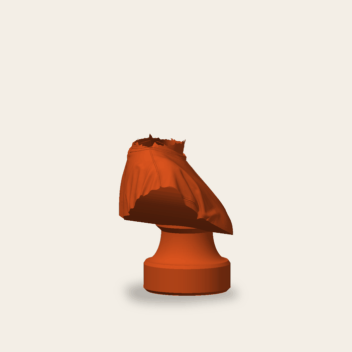
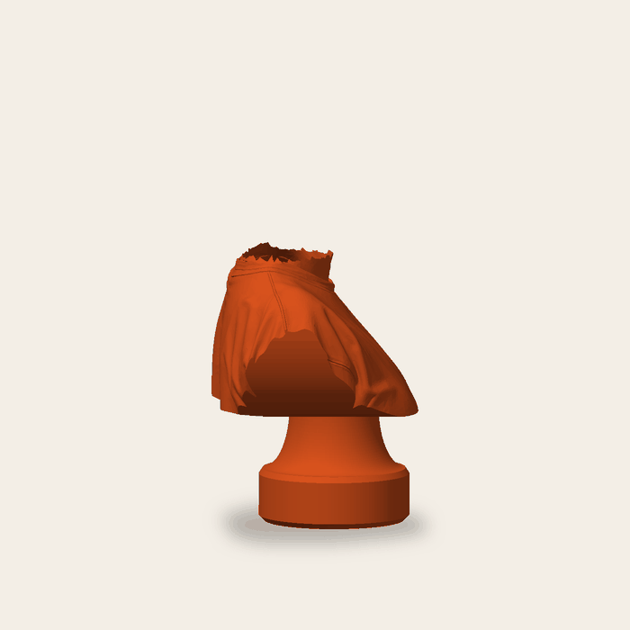
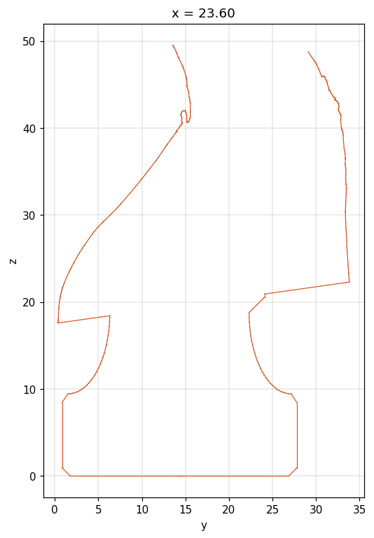
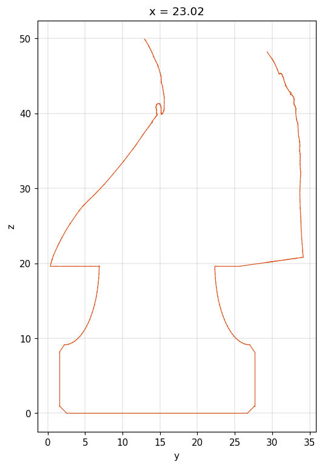
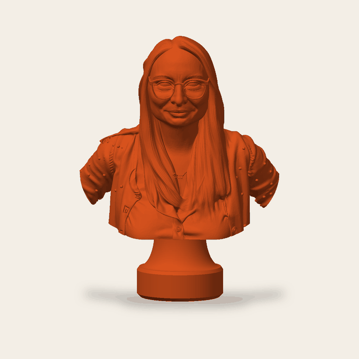
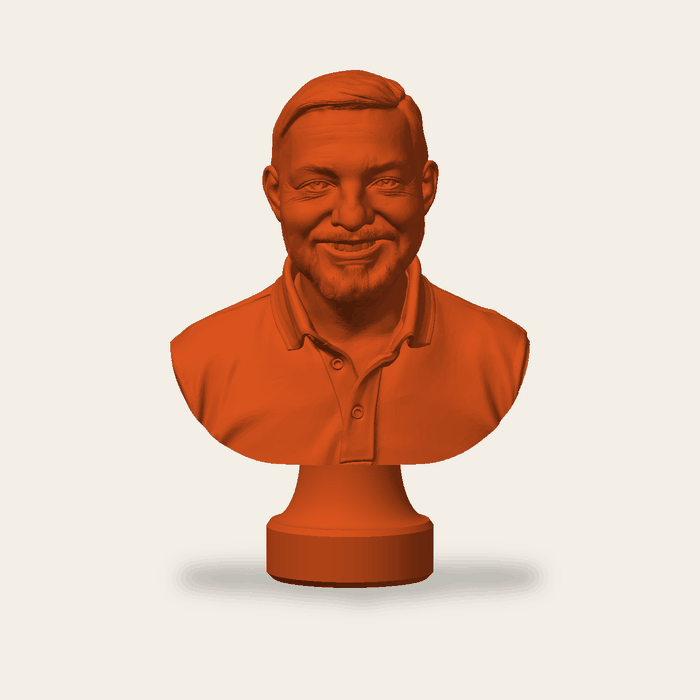
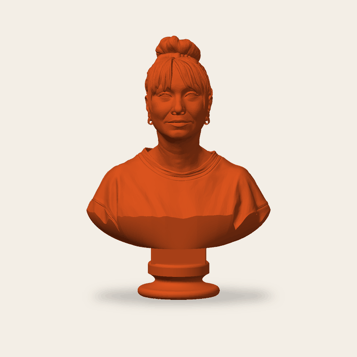

# Busta z fotky: oprava řezu hrudi a soklu

Větev `feature/bust-fixes` (z `main` 7ddf958), 4. 10. 2026. Zadání: `docs/prompts/bust-fixes.md`.
Změny jsou jen v `engines/python/mesh_tool.py`, v testu `tests/Feature/FigureToolTest.php` a ve fixtuře
`tests/Support/MeshFixtures.php`. PHP kód (`GenerateModel`, `PedestalChanger`) se nemění.

## Vzorek chyby

Zakázka `3591a079-17d0-41f1-b1fd-59ae75df022a` (3. 10. 2026, 05:53, busta z fotky, styl „socle“, 80 mm; vytištěná
ve 175 % = 83 × 63 × 140 mm). Lokální reprodukce z `files/<uuid>/source.stl` dává stejný výsledek jako server
(283 404 vs. 283 556 trojúhelníků; `mesh_tool.py` na serveru je totožný s `main`).

| před | po |
|---|---|
|  |  |
|  |  |
|  |  |

Řezy jsou svislé roviny osou nožky (y = hloubka, z = výška, mm; vlevo je přední strana busty).

## Co bylo špatně

1. **Límec soklu vyčuhoval.** `bust_shape("socle")` řezal hruď jednou šikmou plochou (oblouk zdola, celý skloněný
   o 8° dozadu kolem přední hrany) a vršek nožky („seat“) počítal tak, aby *horní hrana* límce byla v těle u zadního
   okraje límce. Svislá stěna límce (4,5 mm) a jeho 45° rozšíření (2,2 mm) tím zůstaly pod řeznou plochou vepředu
   a po stranách, kde plocha klesá – zepředu bylo vidět ≈ 5 mm límce (ve 175 % tisku 9 mm), mezi šikmou plochou
   a svislou stěnou límce vznikaly klíny/„díry“. Řez `img/bust-fixes-before-section.png`: šikmá čára spodku hrudi
   protíná modrý obdélník límce.
2. **Roztřepená spodní hrana hrudi.** `seat_of` vrátil z = 0,24 mm nad spodkem zdrojové sítě a řez (`trim_by_plane`
   + `arc_cut`) začínal přesně tam. Spodních ≈ 4 mm zdroje je ale roztrhaný okraj generátoru uzavřený voxelovým
   rebuildem (`img/bust-fixes-source-bottom.png`): obvod průřezu klesá z 278 mm (z = 0) na 216 mm (z = 4) při stejné
   ploše, tj. obrys je plný zářezů a třísek. Přední spodní hrana hotové busty byla tedy prakticky neořezaný roztrhaný
   okraj, po stranách oblouk stoupal a hranu minul.

Oba jevy se týkají jen zdrojů, kde generátor vrátí tělo až k loktům s otevřeným spodkem (u vzorků z 22. 9. a 30. 9.
je spodek hladký a nic se na nich nemění).

## Co se změnilo (`mesh_tool.py`)

- **`clean_level(m, z_from, target)`** – nová „zdravá vrstva“. Po 0,25 mm se řeže vodorovný průřez a porovnává se
  s vlastní vyhlazenou verzí (morfologické otevření a uzavření poloměrem 1 mm, tj. zářezy a třísky užší než 2 mm):
  `rough = (plocha_uzavřeného − plocha_otevřeného) / obvod` je střední hloubka drsnosti v mm, `spike` totéž jen pro
  třísky. Řez jde 0,5 mm nad nejnižší vrstvu, od níž jsou 2 mm vrstev hladké (`rough ≤ 0,06`, `spike ≤ 0,03`,
  rozměry pro 80mm model, škálují se s `target`). Strop 8 % výšky; když se do stropu hladká vrstva nenajde, model se
  nechá být (je detailní, ne roztrhaný). Změřeno na vzorcích: chybový vzorek 0,19 → 0,10 → 0,03 od z = 4,05 (řez
  zvednut o 4,05 mm); čisté vzorky 0,02–0,04 od spodku (beze změny).
  Zvednutý řez platí pro všechny podstavce: u `socle/antique/cut` je to rovina řezu hrudi, u `round/square/…`
  se tělo ořízne také (roztrhané milimetry by jinak koukaly nad okrajem podstavce) a podstavec sedí o to výš.
  Report: `cut_raised` (mm).
- **`arc_cut(body, m, cx, z_cut, rise, tilt, flat_half, tilt_from)`** – oblouk má uprostřed rovnou plošku
  (`flat_half = r_límce + 2 mm` na každou stranu) a teprve od ní stoupá k ramenům; sklon dozadu (8°) začíná až za
  límcem (`tilt_from = y_nožky + r_límce + 2 mm`), vepředu je řez vodorovný. Pod celým límcem je tedy rovná plocha
  v z = `cut_z`.
- **`bust_shape("socle")`** – límec leží celý v hrudi: `room_for()` spočítá skutečné průřezy hrudi ve třech výškách
  (spodek rozšíření 0,3 mm nad řezem, polovina, vršek límce = `cut_z + 0,3 + flare + collar_h + overlap`), každý
  zmenší o `r_límce + 1,5 mm` a protne. Nožka stojí v nejbližším bodě této oblasti k těžišti průřezu hrudi (hlídá se
  jen, aby těžiště busty nebylo víc než 0,45 r_nohy za osou nožky). Oblouk se po posunu nožky přepočítá (až 3 průchody).
  Když se límec nevejde: nejdřív bez rozšíření (jen `r_top`, rezerva 1,5 mm), pak rezerva 0,5 mm, a když ani to,
  `ValueError("collar_does_not_fit")` → stávající záloha na „round“ (`socle_fallback`).
  Pevné rozhodnutí: límec je skrytý *celý* (i 45° rozšíření), zvenku vidět jen krček `r_top` vcházející kolmo do
  rovné plochy. Viditelná výška nohy = `foot − collar_h` (≈ 26 mm u 80mm busty), skrytá část 0,3 + flare + collar_h,
  překryv 2,8 mm nad tím.
- **`socle_mesh`** – profil bere `r_collar`, `flare`, `collar_h` ze `sizes` (bez rozšíření, když je `flare = 0`);
  `pedestal_height` = celá noha po vršek límce bez překryvu.
- **`bust_shape("antique")`** – destička musí ležet v hrudi s rezervou 1,5 mm ve třech výškách (opsaná kružnice
  destičky); jinak se posune pod střed hrudi, jinak zmenší (0,85, 0,7), jinak `ValueError` → „round“. Rovná část
  zaoblení spodku (`round_under`) je středěná na destičku a kryje ji.
- **`round/square/hexagon/column/plaque`** – geometrie beze změny (jen zvednutý řez, viz výše); jejich překryv je vršek
  jednoho válce/hranolu od podložky, nic z něj netrčí – ověřeno na `round` u chybového vzorku.
- **Report** (JSON `normalize`, u `socle`/`antique`, v souřadnicích zapsaného souboru): `cut_z`, `foot_x`, `foot_y`,
  `foot_r`, `collar_r`, `collar_top_z`, `foot_outside_mm3` (objem nohy mimo tělo), `foot_below_cut_mm3` (objem nohy
  pod rovinou řezu). Rovnost obou objemů = nic z límce není vidět. U všech čtyř vzorků je rovnost přesná.

## Ověření na vzorcích (ze serveru, `storage/app/models/files/<uuid>/source.stl`)

| uuid | styl | spodek zdroje | `cut_raised` | noha mimo / pod řezem (mm³) |
|---|---|---|---|---|
| 3591a079 (chyba) | socle | roztrhaný do 4 mm | 4,05 | 7 374,7 / 7 374,7 |
| 3591a079 | antique | – | 4,05 | 4 328,3 / 4 328,3 |
| 3591a079 | cut, round | – | 4,05 | – |
| fdfff703 (30. 9., bunda, ruce) | socle | hladký | 0 | 7 367,9 / 7 367,9 |
| 0c4644a6 (22. 9.) | socle | hladký | 0 | 7 371,4 / 7 371,4 |
| 4eb484d3 (ležící hlava, 49 mm vysoká) | socle | drsný do 6,5 mm (> strop 3,9) | 0 | 4 100,2 / 4 100,2 |
| 3591a079 | socle + jméno „Lucie“ | – | 4,05 | 7 397,4 / 7 397,4 |
| 3591a079 | socle, sink 20 % | čistý po sink-řezu | 0 | 7 363,8 / 7 363,8 |
| fdfff703 | antique (hruď prodloužena o 12,9 mm) | hladký | 0 | 4 328,6 / 4 328,6 |

 

Vzhledové rozdíly oproti dnešku u dobrých bust: spodek hrudi je uprostřed vodorovný (dřív celý skloněný o 8°),
sklon začíná až za límcem; noha stojí pod těžištěm průřezu hrudi (dřív posunutá dopředu k přední hraně).

## Test

`FigureToolTest::test_torn_bottom_gets_a_flat_cut_and_the_socle_collar_stays_inside_the_chest` – syntetická busta
(`MeshFixtures::tornBustStl`: oválná hruď, krk, hlava, spodní 3 mm náhodně rozedrané zářezy 1,3 mm široké, seed
pevný). Po `normalize … socle` platí: watertight, 1 těleso, `cut_raised > 1,5`, objem nohy mimo tělo = objem pod
řezem (±1 %), vršek límce ≥ 3 mm nad řezem; a nezávisle nad trojúhelníky výsledného STL (čistě v PHP):
pod rovinou řezu (−0,2 mm) jsou jen trojúhelníky do `foot_r + 0,3` od osy nožky (nic z hrudi nevisí dolů, nic
z nohy netrčí do stran); všechny trojúhelníky s normálou dolů do `collar_r + 2` od osy leží v `cut_z ± 0,2`
(rovná řezná plocha). Totéž tělo projde i `antique` a `round`. Bez Pythonu s manifold3d se test přeskočí.

Výklad bodu „žádné trojúhelníky těla pod horní hranou límce vně nožky“ ze zadání: pod rovinou řezu nesmí být nic
než noha (hruď nevisí pod řez, límec netrčí do stran); nad řezem límec nemůže být vidět, protože objem nohy mimo
tělo = objem pod řezem.

## Nasazení

Jen `php artisan optimize` (+ restart fronty/`php-fpm` podle `docs/DEPLOY-BETA.md`); Python se nebuildí, žádné nové
balíčky (manifold3d, trimesh, scipy, scikit-image už na serveru jsou). Starší hotové busty se nemění; zákazník
(nebo my) je opraví přes „Změnit podstavec“ (`POST /api/files/{uuid}/pedestal`), které jede ze `source.stl`
a projde novým kódem.

## Otevřené / rozhodnuto bez dotazu

- Umístění nožky „pod těžiště průřezu“ (zadání) místo dřívějšího posunu dopředu: měřeno od přední hrany hrudi leží
  osa nožky u vzorku 3591a079 o 1,5 mm a u fdfff703 o 3,7 mm dál vzadu než dřív; vzhledově odpovídá bustě ležící
  na soklu a těžiště busty zůstává nad nohou.
- Strop zvednutí řezu 8 % výšky: vzorek 4eb484d3 (drsný do 6,5 mm z 49 mm) se nechává být.
- `trim_loose`, `bust_cut` a `rebuild_solid` se neměnily; příčina roztřepení není v nich, ale v tom, kde se řezalo.
