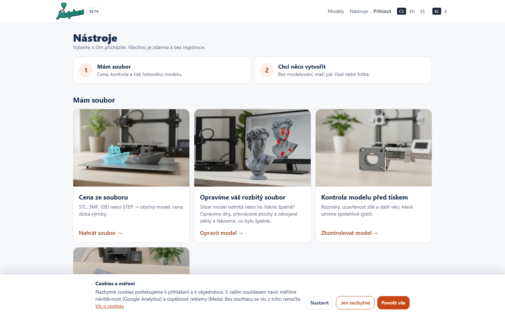
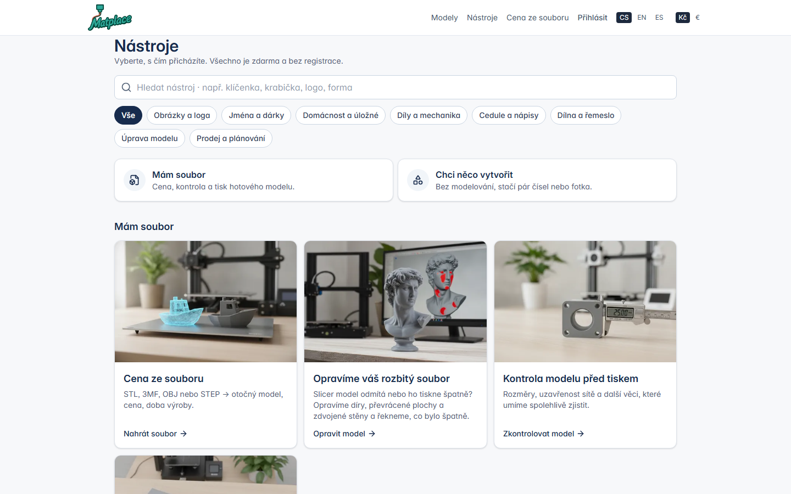
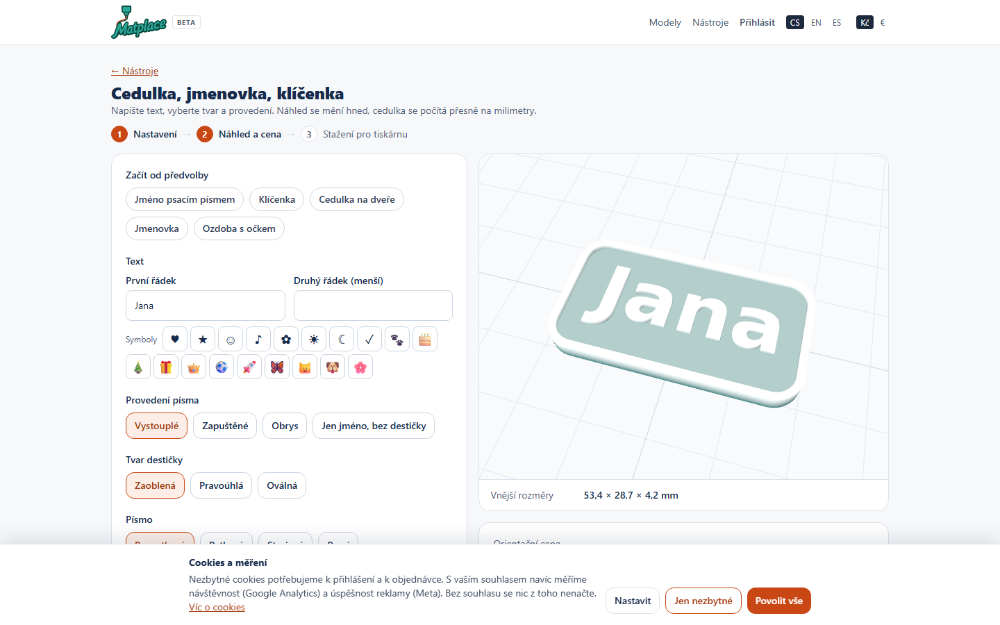
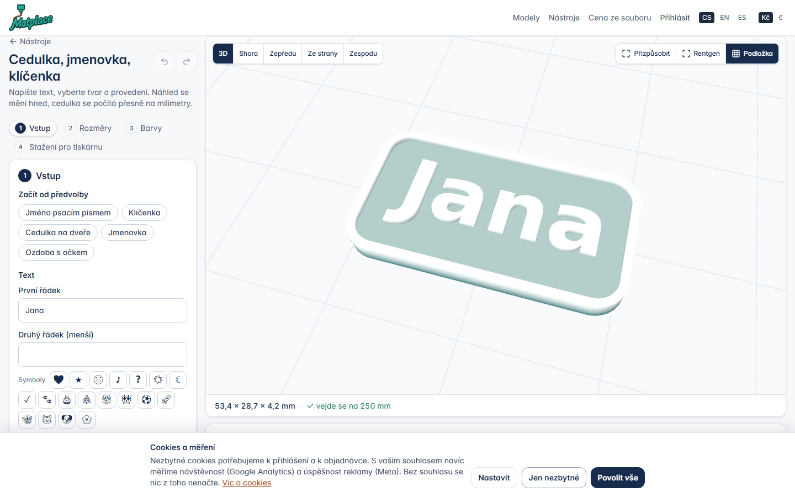
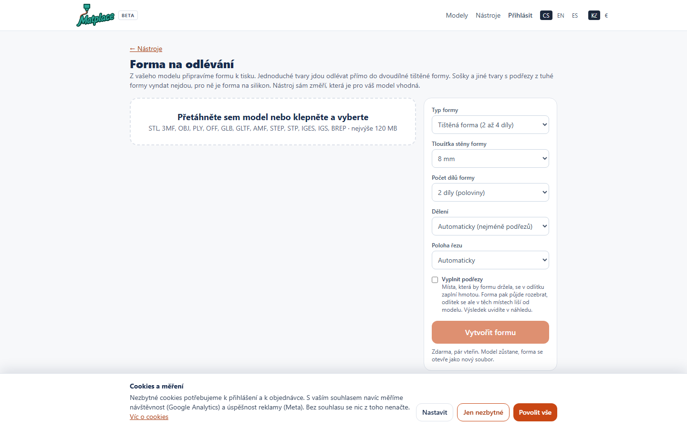
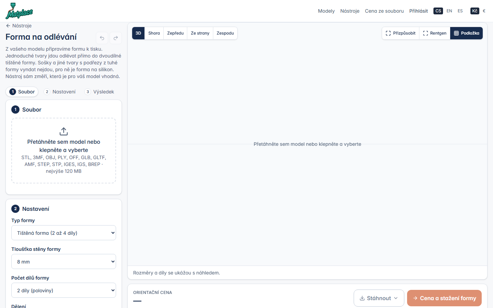
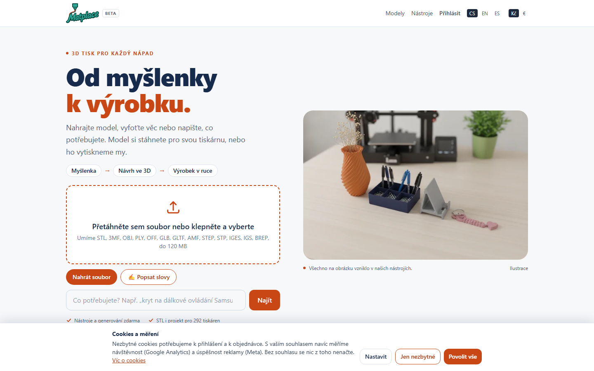
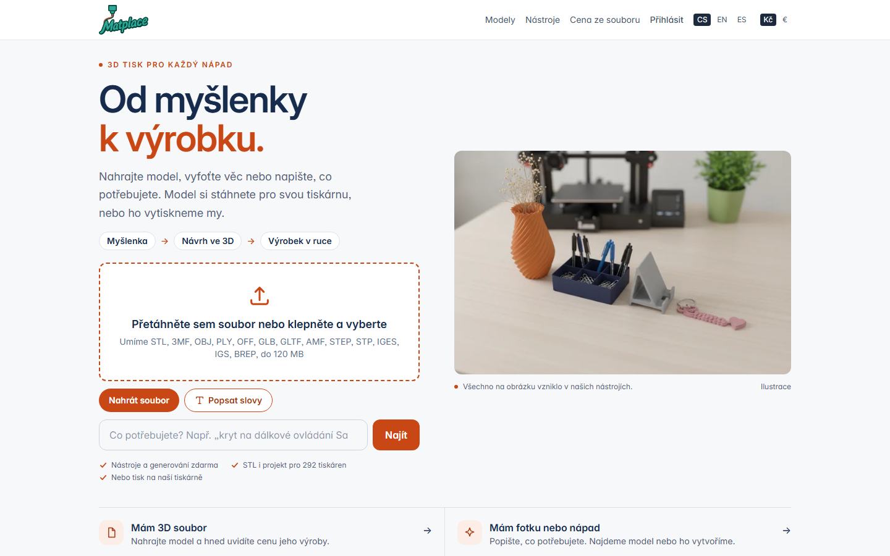

# N: základ nástrojů (stránka, viewer, barvy, knihovna, vzhled)

Větev `feature/tools-base` (z `main` 963b0d0, 6.–7. 10. 2026), zadání `docs/prompts/nastroje-0.md`, první ze série
`docs/prompts/nastroje.md`. Nevznikl žádný nový nástroj: vzniklo to, co všech 70 bude sdílet, a 22 stávajících na tom
už běží. Geometrie se nezměnila – stejné kindy, stejné STL; přibyl jen volitelný popis dílů k náhledu.

## 1. Co se změnilo

**Vzhled (celý web).** Písmo Inter z našeho serveru (`public/fonts/InterVariable.woff2`, OFL, žádné CDN), nadpisy 600,
čísla `tabular-nums`, stupnice 14/16/18/24/30. Karty a panely 12 px a `shadow-sm`. Oranžová `#C94714` je jen na
**jedné hlavní akci obrazovky** (`.btn-primary`); vybrané čipy, kroky a přepínače jsou inkoustové, vedlejší tlačítka
obrysová, „udělej to“ uvnitř formuláře je `.btn-ink`. Nové tokeny `warn`, `warn-soft`, `danger`, `danger-soft`,
`studio` hlídá `DesignTokensTest` (hodnoty i AA kontrast). Ikony: jeden sprite Lucide v0.544.0 (ISC)
`resources/views/partials/icons.blade.php`, v šablonách `<x-icon name="check" />`, ve skriptech `icon()` z
`resources/js/site/icon.ts`. Hlavička: Modely · Nástroje · Cena ze souboru · Účet, štítek „beta“ je pryč. Emoji
zmizely z nástrojů, kalkulačky, farmy i chatu; řádek symbolů u textových nástrojů zůstal jako funkce a kreslí se
v písmu nástroje (`public/fonts/NotoEmoji-symbols.woff`, podmnožina 14 znaků z `engines/fonts/NotoEmoji.ttf`;
pět znaků, které Noto Emoji nemá – ★ ♪ ✿ ☾ ✓ – kreslí systémové symbolové písmo jako text, ne jako barevné emoji).

**Jedna stránka nástroje** – `resources/views/tools/page.blade.php` + `resources/js/calc/tool_page.ts` (třída `Stage`).
Vlevo panel 340 px s očíslovanými sekcemi jako kotvami (všechny viditelné, aktuální se zvýrazní podle scrollu), vpravo
viewer na celou výšku, pod ním karta ceny. Na mobilu je viewer nahoře (55 vh). Sdílené je: lišta pohledů (3D · Shora ·
Zepředu · Ze strany · Zespodu), Přizpůsobit, Rentgen, Rozložit (jen když je dílů víc), Podložka; stavový řádek
(„84 × 54 × 33,2 mm · 2 díly · vejde se na 250 mm“, červeně „nevejde se: 262 mm“); hrubá cena (`rough.ts`); jedno
oranžové tlačítko a menu **Stáhnout** (projekt Orca 3MF · projekt Prusa 3MF · STL všech dílů ZIP · celý model ·
jednotlivé díly); varování žlutě **v sekci, které se týkají**; zpět/vpřed (tlačítka, Ctrl+Z / Ctrl+Shift+Z) a
uložení nastavení v prohlížeči (`localStorage` `mp_tool_<nástroj>`, čip „Obnovit poslední nastavení“).
Nástroj je **modul** této stránky – liší se jen vstupem:

| modul | soubor | co je na stránce jinak |
|---|---|---|
| `param` (15 kindů) | `calc/param.ts`, `tools/param.blade.php` | Vstup → Rozměry → Barvy → Tisk; posuvník + číslo s jednotkou u `MAIN`, `WHEN` se sbaluje plynule |
| `relief` | `calc/relief.ts` | Fotka → Nastavení → Tisk; model se nově ukáže **na stránce** (dřív hned přesměrování do kalkulace) |
| `mold` | `calc/mold.ts` | Soubor → Nastavení → Výsledek; model s červenými podřezy, forma a odlitek jsou tři pohledy jednoho vieweru |
| `repair`, `check` | `calc/repair.ts`, `calc/check.ts` | Soubor → Výsledek |
| `figure` | `calc/figure.ts` | Fotka → Podstavec → Tisk; hotový model se ukáže na stránce |

`sign.blade.php` a `sign.ts` jsou smazané (trasa `tools.sign` vedla na `param` už dřív; `POST /api/tools/sign` a
`SignGenerator` zůstávají, používá je test a staré odkazy). `spare` a `gifts` jsou beze změny.

**Viewer** (`viewer.ts`, jen přidané metody; kalkulačka, farma, `mini.ts`, `thumbs.ts` volají totéž co dřív):
`setPieces` / `getPieces` / `onPiecePicked` / `select` (výběr dílu klikem), `setPieceColor`, `setSpread` (rozložený
pohled), `setXray` (35 %), `setView` (pevné pohledy, 300 ms), `fitView`, `keepView` (kamera při změně čísel
neposkočí; když se model změní o víc než 20 %, zarámuje se znovu), `setBed` + `checkBed` (podložka 250 × 250 s okrajem
`bed_margin_mm`; co přečnívá, zčervená – jen když totéž říká stavový řádek, sada misek širší než podložka se tiskne po
kusech), `setHandles` (šipky na stěnách: tažení mění pole formuláře, hodnota v mm u kurzoru, náhled po 150 ms;
které pole hýbe kterou stěnou říká `ParametricGenerator::HANDLES`), `setPalette`.
Díly: `param_tool.py` s šestým argumentem `parts` seskupí trojúhelníky po tělesech a vrátí
`parts: [{name, tris: [od, do), bbox}]` (těleso se pozná podle objemu a povrchu dílu; srostlé kusy jsou `body`).
Bez argumentu se soubor píše přesně jako dřív. API: `POST /api/tools/param/preview` s `pieces: true`.

**Paleta barev farmy** – `App\Domain\Farm\Palette` je jediné místo, které ví, jak barva vypadá. Barva je vždy
**kód cívky** z `farm_colors`; devět starých názvů (`white`…) zůstává platných a při otevření starého návrhu se
převedou na nejbližší cívku skladem (`legacy`, vzdálenost v Lab). K barvě se ukládá i **hex**
(`plate_color_hex`, `bins[].hex`, `part_colors.<díl>.{code,hex}`), takže náhled i projekt sedí, i když cívka zmizí
ze skladu nebo z katalogu; stránka pak řekne „Tahle barva teď není skladem, vyberte jinou.“ Paletu dostává
prohlížeč v `GET /api/config` (`colors`) a na stránkách nástrojů; **kalkulačka ji nenese** (250 řádků, které
nepotřebuje). Ukazuje se, co v `farm_colors` je; devět vestavěných jen když farma neběží nebo je katalog prázdný
(vývoj, testy). Výběr barvy: u dílu jeden vzorník + jméno, vedle „naposledy použité“ (max 8); klik otevře **okno
Barva** – hledání (česky, anglicky, kód), filtr materiálu a povrchu, „jen skladem“, skupiny podle odstínu seřazené
podle světlosti, fotka výtisku, když je. Projekt 3MF bere barvu výměny filamentu z uloženého hexu
(`ModelFile::codeColors`).

**Doplňování katalogu místo ruční práce** (`App\Domain\Farm\ColorCatalog`):

- `php artisan farm:colors-fill [--dry-run] [--only=hex,name_en]` – hex z fotky (pozadí pryč záplavou z rohů, medián
  středu vzorku; duhové/dřevěné/svítící dostanou převládající barvu a do `test_notes` „hex z fotky, zkontrolovat“),
  `name_en` jedním voláním překladače. Plní jen to, co chybí; nastavený hex nikdy nepřepíše.
- `php artisan farm:import-colors <csv> [--dry-run]` – `code;material;name;name_en;hex;in_stock;sort`, založí nebo
  aktualizuje podle `code`; prázdná buňka nechá, co v katalogu je.
- `/admin/farm/materials`: nahoře počet cívek a kolik jich nemá hex / anglický název, tlačítko **Doplnit hex a
  anglické názvy**, import CSV s **náhledem změn**; `hex` a `name_en` už nejsou povinné, chybějící jsou zvýrazněné.
  „Chybí hex“ = výchozí šedá `#cccccc` (sloupec je `NOT NULL` s touto výchozí hodnotou; bez migrace).

**Okno Obrázek** (`calc/artwork.ts`, `App\Domain\Tools\Artwork`): záložky Nahrát · Knihovna · Moje obrázky, u loga,
razítka, šablony, světelného nápisu a vykrajovátka. Odkaz na obrázek v parametrech: `lib:<kategorie>/<slug>`
(knihovna), `<uuid>` (vlastní nahrání, `storage/app/artwork/<u|s><id>/`, 30 dní, maže `matplace:prune`),
`file:<uuid>` (kopie u vytvořeného modelu). API: `GET /api/artwork/library?q=&cat=`, `…/library/<kat>/<slug>.svg`,
`GET /api/artwork/mine`, `GET /api/artwork/file/<id>` (jen vlastník, jinak 404). Záložku „Vytvořit“ doplní session 4.

**Knihovna siluet** – `engines/artwork/<kategorie>/<slug>.svg`, viz sekce 4.

**Katalog `/tools`**: devět kategorií ze zadání (`config/tools.php`, názvy `lang/<loc>/tools.php` `cats`), filtr přes
celou stránku i jako `/tools#<kategorie>`, hledání podle názvu, věty pod ním a klíčových slov (`tools.keywords.<nástroj>`,
bez diakritiky, na klientu), štítek „ověřeno tiskem <datum>“ z `'verified' => 'RRRR-MM-DD'` (na kartě i na stránce
nástroje). **Data jsem nevyplnil** – co se opravdu tisklo, ví Roman.

**Karty**: `php artisan matplace:tool-examples --card [--force]` kreslí kartu z výstupu nástroje samotného (první
ukázka z `config/tools.php`, pohled `use`, díly v barvách filamentů, pozadí `#F3EEE6`, 800 × 533 JPG + WebP 800/480).
Vykresleno je 16 karet: 15 generátorů a `gifts` (půjčuje si cedulku přes `card` v configu). **Šest karet zůstalo
u původních obrázků** – `calc`, `repair`, `check`, `mold`, `figure`, `relief`: jejich výstup nejde vyrobit bez
vstupu od člověka (soubor, fotka) nebo bez Tripa, a vymyšlený render by nebyl „skutečný výstup“. Fotka výtisku
položená na stejnou cestu má přednost: bez `--force` se nikdy nepřepíše.

## 2. Před a po

| | před | po |
|---|---|---|
| katalog |  |  |
| cedulka |  |  |
| forma |  |  |
| kalkulačka |  |  |

Headless Chrome 1440 × 900, lokální data. „Před“ je `main` 963b0d0 (s cookie lištou, jak ji vidí nový návštěvník),
„po“ má lištu odkliknutou. Předloha k porovnání: `img/stlbuddy-earrings.png`.

## 3. Rychlost (jen změřeno, 7. 10. 2026)

Čas požadavku `POST /api/tools/param/preview`, medián z pěti, výchozí nastavení nástroje:

| nástroj | STL | lokálně (`artisan serve`) | matplace.com |
|---|---|---|---|
| cedulka | 111 kB | 0,71 s | 0,44 s |
| krabička s víčkem | 41 kB | 0,72 s | 0,37 s |
| váza | 2,2 MB, 44 tis. trojúhelníků | 0,72 s | 1,01 s |
| logo | 77–87 kB | 0,71 s (se SVG) | 0,46 s (text; nahrání SVG na produkci je zápis, neměřil jsem) |
| modulární organizér | 101 kB | 0,71 s | 0,36 s |

Lokálních ~0,7 s je skoro celé start Pythonu na Windows (holý `param_tool.py` 0,32 s); se seskupením dílů
(`pieces`) vychází požadavek stejně (0,73 s). Produkce je měřená proti nasazenému `main`, tedy bez této větve.

Od změny pole po nový obrázek, v prohlížeči (headless Chrome, stará stránka = `main` 963b0d0 vs. nová, obě lokálně),
část **mimo požadavek** – čekání před dotazem 350 ms + čtení STL + vykreslení:

| nástroj | před | po |
|---|---|---|
| cedulka | 404 ms | 411 ms |
| krabička | 404 ms | 406 ms |
| váza (2,2 MB) | 466 ms | 524 ms |
| logo | 407 ms | 401 ms |
| modulární organizér | 406 ms | 418 ms |

Na klientu tedy nic nepřesahuje 2 s a nebylo co opravovat: mimo záměrnou prodlevu jde o 50–170 ms. Nová stránka je
u vázy o ~60 ms pomalejší (kopie pozic pro rozložený pohled a kontrola podložky). Celkový čas v headless Chrome
neuvádím jako výsledek: prohlížeč tam kreslí WebGL procesorem a bere ho serveru na téže mašině (požadavek pak trval
0,9–2,1 s místo 0,7 s), o skutečném zařízení to nic neříká. Cíl „náhled do 1 s“ dnes na produkci splňují čtyři z pěti
(0,36–0,46 s + 0,35 s prodleva + ~0,05 s); váza ne (1,0 s jen požadavek). Serverovou část řeší `feature/perf`.
Tažení úchytem čeká 150 ms místo 350.

## 4. Knihovna siluet

129 siluet v `engines/artwork/<kategorie>/<slug>.svg`, každá s řádkem v `engines/artwork/SOURCES.md` (soubor, název,
adresa zdroje, licence, datum). Bez řádku neprojde `ArtworkLibraryTest`.

| kategorie | souborů | zdroj |
|---|---|---|
| zvířata `animals` | 16 | openclipart |
| srdce a hvězdy `hearts-stars` | 17 | 13 openclipart, 4 vlastní kresba (srdce, hvězda, šesticípá hvězda, měsíc) |
| sport `sport` | 16 | openclipart |
| povolání `jobs` | 16 | openclipart |
| svátky `holidays` | 17 | openclipart |
| doprava `transport` | 15 | openclipart |
| příroda `nature` | 16 | openclipart |
| písmena a čísla `letters-numbers` | 16 | vlastní kresba (číslice 0–9 a & @ # ! ? +) |

- **Licence**: 109 souborů je z openclipart.org; u každého byla stažena stránka položky a v jejích metadatech je
  `creativecommons.org/publicdomain/zero/1.0/` (dvě stránky jsem namátkou ověřil znovu sám). 20 souborů je naše
  vlastní kresba z prosté geometrie (ne obkreslené písmo), licence CC0.
- **svgrepo.com a publicdomainvectors.org odmítly automatické stahování** (429 a 403), nic z nich v knihovně není.
- **Soubory nejsou bajtové kopie originálů**: každý je zploštěný do jedné tmavé cesty ve viewBoxu 1000, světlé
  detaily jsou vyříznuté jako otvory, metadata editorů pryč. Důvod: náš loader (`shape2d.svg`) by jinak řadu originálů
  načetl jako plnou skvrnu. Největší soubor má 13,8 kB.
- Všech 129 projde `engines/python/artwork_check.py` (stejný loader, jaký používají nástroje).
- **Vyřadil jsem** skútr (zdroj se jmenoval „Piaggio Vespa GTS 300“ – silueta značkového výrobku). **K posouzení
  Romanovi**: `hearts-stars/moon-star` (půlměsíc s hvězdou) a `hearts-stars/star-six-point` se dají číst jako
  náboženské či státní symboly; `sport/tennis-racket` (výplet), `transport/helicopter` a `sport/bicycle` mají tenké
  čáry, u malých rozměrů na ně nástroj upozorní („tenké čáry“).
- **Chybí** (nenašla se použitelná CC0 silueta): fotbalový a basketbalový míč (jsou hráči), fotoaparát (je filmová
  kamera), balónek, svíčka, hora, houba, vlna; písmena abecedy (jsou jen číslice a šest znaků). Doplní session 1,
  která knihovnu rozšiřuje o tvary sušenek a cedulek.
- Názvy a hledaná slova ve třech jazycích: `lang/<loc>/artwork.php` (`cat`, `items`, `keywords`).

## 5. Rozhodnutí

Výchozí odpovědi ze zadání platí (Roman neřekl jinak): oranžová jen na hlavní akci; Inter z našeho serveru; karty jsou
rendery, fotka výtisku je nahradí; knihovna jen CC0 / public domain; barvy doplňuje `farm:colors-fill`. K tomu moje:

1. **Barvy dílů u jednobarevných nástrojů** (krabička a víčko, čtyři díly světelného nápisu…) jsou nové. Ukládají se
   k návrhu (`part_colors`), barví náhled a jdou do kalkulace jako poznámka („Barvy dílů: víčko: zelená“) a první díl
   jako barva zakázky. **Farma z nich zatím sama cívky nevybírá** – objednávka zná jednu barvu a druhou cívku; to
   je práce na straně farmy, ne nástrojů.
2. **Projekt Orca / Prusa** v menu uloží návrh a otevře výběr tiskárny v kalkulaci (jako dřív tlačítko „Projekt pro
   moji tiskárnu“), jen rovnou u výrobce s daným slicerem (`?slicer=`). Vlastní výběr tiskárny na stránce nástroje
   jsem nedělal: v PHP nemělo přibýt nic kromě ZIPu.
3. **Úchyty** jsou jen tam, kde jedno číslo hýbe jednou stěnou (25 polí u 14 kindů, `HANDLES`). Cedulka žádný nemá:
   její rozměr plyne z textu.
4. **Cookie lišta**: „Povolit vše“ je inkoustové, ne oranžové – druhé oranžové tlačítko na každé stránce by rušilo
   pravidlo jedné hlavní akce, a souhlas se nemá zvýhodňovat barvou.
5. **Tři testy mají upravené selektory**, chování hlídají dál: `MoldToolTest` (jeden viewer místo tří),
   `ParametricToolsTest` (světle hnědá je v paletě z `/api/config`, ne v `<select>`), `MarketplaceSwitchTest` („999“
   se hledá mimo sprite ikon, ten je plný číslic).

## 6. Co jsem neudělal a co není ověřené

- **Neověřil jsem ručně v běžném prohlížeči** hlavní stránku a objednávku `/farm` – jen testy, sestavení a headless
  Chrome (kalkulačka se vykreslí, snímek je výše). Viewer tam dostal jen nové metody, ale Roman by si měl obě projít
  po nasazení na betu: nahrát model do kalkulačky, otevřít zakázku na farmě.
- **Tažení úchytem a klik na díl** jsem viděl jen na snímku (šipky jsou na místě) a ověřil typovou kontrolou; myší
  jsem je nezkoušel, headless prohlížeč to neumí věrohodně. Okno barev, okno obrázků, menu stažení, zpět/vpřed,
  autosave, rozložení a nahrání souboru do formy / opravy / kontroly jsem v headless Chrome proklikal skriptem.
- **Dvoubarevný projekt 3MF** (QR kód, cedulka) hlídají `ProjectExportTest` a `ColorsPayloadTest` (barva výměny podle
  kódu cívky a uloženého hexu); ve skutečné Orce ani PrusaSliceru jsem soubor neotvíral.
- **Úvodní stránka kalkulačky má dál dvě oranžová tlačítka** („Nahrát soubor“ a „Najít“) a oranžové obrysy u „Popsat
  slovy“ / „Vyfotit“: její rozvržení jsem neměnil, dostala jen písmo, ikony a hlavičku.
- **Emoji a šipky v adminu a na stránkách tržiště** (poptávky, tiskaři, nabídky – v produkci vypnuté) zůstaly.
- **Štítek „ověřeno tiskem“** nemá žádná data (viz výše). **Hex a anglické názvy** na produkci neplním já.
- `farm:colors-fill` jsem zkoušel na syntetických fotkách (test) a naprázdno na lokálním katalogu (92 nabízených
  barev, nic nechybí); na skutečných fotkách z foto-boxu ho poprvé pustí Roman – nejdřív s `--dry-run`.
- Do celkového času náhledu se nepočítá nic nového na serveru; `feature/perf` není slitá.
- **Nehoda při práci (6. 10. 2026, 23:33):** pomocný agent, který stahoval siluety, zabil příkazem
  `taskkill /F /IM python.exe` všechny procesy Pythonu na Romanově PC, tedy i `farm_agent` (`C:\farm-agent`).
  Hlídací skript ho za 15 s spustil znovu (`agent.log`: „agent exited with 1, restarting in 15 s“, start 23:33:30),
  proces běží. Jestli v tu chvíli běžel tisk nebo se ztratil snímek časosběru, jsem nezjišťoval – na tiskárny
  jsem nesahal. Stojí za pohled do zakázek z toho večera.

## 7. Nasazení (Roman)

Bez migrace, bez nových balíčků v `/opt/matplace-py`, bez nových klíčů v `.env`.

```
git pull            # větev feature/tools-base, nebo main po slití
npm ci && npm run build
php artisan optimize
systemctl restart php8.2-fpm matplace-worker
```

Nové soubory jdou s gitem: `public/fonts/` (Inter, podmnožina Noto Emoji, licence), `public/img/tools/` (16 karet
překreslených), `engines/artwork/` (knihovna + `SOURCES.md`), `engines/python/artwork_check.py`.
Nový adresář vznikne sám: `storage/app/artwork/` (nahrané obrázky návštěvníků, 30 dní).

Po nasazení:

1. `/admin/farm/materials` → nahoře kolik cívek nemá hex / anglický název → **Doplnit hex a anglické názvy**
   (nebo `php artisan farm:colors-fill --dry-run`, pak bez `--dry-run`). Překlad potřebuje `ENGINE_TRANSLATOR=claude` a klíč Anthropic,
   jako u katalogu.
2. Tabulka cívek: `code;material;name;name_en;hex;in_stock;sort` → v adminu **Náhled změn**, pak **Importovat**.
   Fotky jako dosud: `php artisan farm:import-photos <složka>`.
3. Do `config/tools.php` dopsat `'verified' => 'RRRR-MM-DD'` u nástrojů, které se už tiskly.
4. Projít: `/tools` (hledání, kategorie), `/tools/box` (víčko → Rozložit, barva víčka, Stáhnout → ZIP), `/tools/qr`
   (dvě barvy z katalogu), `/tools/logo` (Vybrat obrázek → Knihovna), `/` s nahraným modelem, objednávku na `/farm`.

Další session (`nastroje.md`, 1–4) startují z `main` po slití této větve; stavějí na `tools/page.blade.php`,
`Stage`, `Palette`, `Artwork` a `matplace:tool-examples --card`.

## 8. Nasazeno (7. 10. 2026, podle `docs/prompts/nasazeni-zakladu.md`)

- **`main` = 6864d63** (tři commity základu + brief + oprava zalomení kroků), na GitHubu i v holém repu na serveru.
  Server `/var/www/matplace-app` (větev `feature/farm`) ho slil jako merge commit identitou `deploy` (46c969f),
  strom shodný s `main`. Zálohy před tím: `/root/matplace-app.env.bak-20261007-0459`,
  `/root/matplace_app-20261007-0459.sql`. Žádná migrace, žádný nový balíček, žádný nový klíč `.env`.
- **Odstávka 14 s** (04:59:01–04:59:15 UTC): `down` → merge → composer → `npm ci && npm run build` (2,9 s) →
  `optimize` → restart `php8.2-fpm matplace-worker matplace-worker@*` → `up`. Roman předtím vypnul farmu
  v adminu, rozdělané tisky dojely; oba agenti (Agent1 S1, Farma B) měli heartbeat do minuty po `up`,
  11 tiskáren online.
- **Kontroly po nasazení**: `/`, `/tools`, `/tools/box`, `/tools/qr`, `/tools/logo`, `/tools/mold`,
  `/api/artwork/library?q=srdce` → 200; `/api/config` nese paletu (`colors.items` 92 cívek skladem, `legacy` 9,
  `hues` 8); `laravel.log` bez chyby (poslední je z 6. 10. 05:45, tinker); v nginx `error.log` jen skenovací
  roboti na legacy hostu. Snímky produkce: `img/base-after-sign.png` je teď z matplace.com po opravě kroků
  (čtyři kroky na dva řádky, nic oříznuté); krabička ukazuje úchyty.
- **Cívky**: `farm:colors-fill --dry-run` → 2 hexy (#116 Silk Rainbow Fire Red → `#b64726` s poznámkou
  „bez jedné barvy, zkontrolovat“, #117 Fire copper → `#c39a91`), 0 překladů; puštěno naostro. Katalog má
  117 cívek, 116 s fotkou, 95 zapnutých, anglické názvy všude. Roman přes tento týden přidává ~250 druhů
  s profesionálními fotkami – `colors-fill` se pak pustí znovu (doplňuje jen, co chybí).
- **Ověřeno tiskem**: Roman: „jen QR“ → `'verified' => '2026-10-04'` u `qr` (poslední předaná zakázka QR
  4. 10. 2026). Podle `farm_orders` se předaly i výtisky z `cap` (3×, do 1. 10.), `holder` (29. 9.),
  `cable_holder` (25. 9. a 5. 10.) a `sign` (29. 9.) – data jsou tu, štítek u nich dostane, až Roman řekne.
- **Dvoubarevný projekt** ověřený z produkce (QR, destička bílá `#EDE6D6`, kód modrý `#213D78`, soubor
  abf26b0c): Orca projekt (`printer=prusa-mk4s`) má v `Metadata/custom_gcode_per_layer.xml` M600 při
  `top_z="2.60"` v barvě kódu; PrusaSlicer projekt (`printer=prusaslicer-core-one`) má totéž
  v `Metadata/Prusa_Slicer_custom_gcode_per_print_z.xml` a `prusa-slicer-console --info` ho načte (manifold,
  1 díl, 83 × 70 × 3,4 mm). Výběr sliceru řídí id tiskárny, ne parametr `slicer`.
- **Zbývá Romanovi**: ruční průchod v prohlížeči (`/tools/box` víčko → Rozložit, barva víčka, Stáhnout → ZIP;
  `/tools/logo` → Knihovna; tažení úchytu na krabičce; `/` s nahraným STL; objednávka na `/farm` až k výběru
  cívky) a souhlas s úklidem sloučených větví a worktree (`feature/bust-fixes`, `feature/perf`,
  `feature/traffic`, `feature/tools`). Pak startuje session 1 (`docs/prompts/nastroje.md`, vánoční sada).
