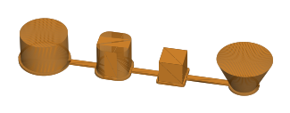

# V: ladění tiskových parametrů farmy (session F)

Větev `feature/print-tuning` (z `main` 95ea9d6, 10. 10. 2026), zadání `docs/prompts/ladeni-tisku.md`. Roman:
začít částí 5 – šev (scarf joint). Tenhle dokument je průběžný: každý řádek ladění, každé kolo a výsledek sem.

Vlastní soubory session: `TuningAdvisor.php`, `ProfileLibrary.php`, `TestPrintService.php`,
`database/data/farm_profile_library.json`, `engines/orca/profiles/*`, `engines/python/calib_tool.py`,
`tuning*.blade.php`, `FarmTuningController`, testy `FarmTuningTest`, `FarmNozzleTest`, `TuningAdvisorTest`.

## 1. Šev (část 5 zadání)

### 1.1 Proč ne objekt `quick`

Zadání chtělo vytisknout `quick` dvakrát a porovnat „válcovou část kostky / pilířů“. Na `quick` ale šev není na čem
posoudit:

- kostka je hranatá, šev `aligned` jde do ostrého rohu a **podmíněný scarf** (`seam_slope_conditional = 1`,
  `scarf_angle_threshold = 155°`) se na obvodu s ostrým rohem nepoužije vůbec,
- pilíře na stringing mají Ø 4 mm, tedy obvod 12,6 mm – kratší než samotný scarf (20 mm).

Ověřeno řezem (Anycubic Slicer Next 2.0.0.3 z příkazové řádky, naše profily `machine.json` + `process_standard.json`
+ `filament_pla.json`, podložka 250 mm, výplň 15 %): `quick` se scarfem má šikmé pohyby (G1 se Z uvnitř vrstvy)
**jen na třech pilířích**, na kostce, převisech, mostu ani stěně žádný.

### 1.2 Nový zkušební objekt `seam`

`calib_tool.py seam` – jedna destička 161 × 35 × 21 mm, prvky 20 mm od sebe, zleva:

| prvek | rozměr | k čemu |
|---|---|---|
| válec | Ø 30 × 20 mm | šev je čára po stěně, nemá se kam schovat |
| hranol se zaoblenými rohy | 20 × 20 × 20, R 6 | rovné plochy, ale žádný ostrý roh – scarf se použije |
| kostka | 15 mm | kontrola: šev zůstává v rohu, rozměr a rohy se scarfem nesmí změnit |
| kužel rozšířený nahoru | Ø 16 → 34,65, sklon 25° | scarf na převisu (0,09 mm na vrstvu ≈ 22 % šířky stěny, pod prahem 40 %) |

V administraci: *Vytisknout test* → objekt **Šev**; zaškrtávátko **Šikmý šev (scarf joint)** přidá k nastavení řádku
`TestPrintService::SCARF` (hodnoty ze zadání); pole *Proces navíc (JSON)* je přebije. Bez zaškrtnutí se tiskne šev
podle řádku. U testu je napsáno, s čím se tiskl („šev: scarf external, délka 20 mm, mezera 15%“ / „bez scarfu“).
Hodnocení testu `seam` se ptá na **šev** (není vidět / slabá linka / zřetelná linka / hrubý), **vadu na švu**
(žádná / boule / díry), rozměry kostky a rohy; otvor, převisy, stringing, most a ostatní pole u něj nejsou.
**Hodnocení z fotek (AI)** – `TestPhotoJudge` (po dohodě s řídící session, 10. 10.): pole `seam` a `seam_fault`,
v pokynech popis švu, boule, díry a scarf přechodu. Každý objekt se ptá jen na to, co na něm je
(`TestPhotoJudge::fieldsFor`): test `seam` na šev, rohy kostky, sloní nohu a podložku; ostatní objekty na šev nikdy.
Model **neví, který z dvojice tisků má scarf** – nastavení švu se mu neposílá, aby nehodnotil podle očekávání.
Bez fotky strany se švem zblízka a s bočním světlem odpoví „nelze posoudit“ a řekne si o ni.

Řez téhož objektu dvakrát (místní Anycubic Slicer Next 2.0.0.3, ne serverová Orca – čísla jsou orientační):

| | čas | filament | šikmé pohyby na stěnách (vrstvy 5–15 mm) |
|---|---|---|---|
| dnešní nastavení (`seam_slope_type = none`, `seam_gap = 10%`) | 28 min 9 s | 15,81 g | žádné |
| scarf (`external`, podmíněný, délka 20, 10 kroků, rychlost 100 %, `seam_gap = 15%`, `staggered_inner_seams = 1`) | 30 min 17 s | 15,69 g | válec, zaoblený hranol, kužel: vnější i vnitřní stěna; **kostka žádné** |

Scarf tedy prodlouží tisk oblých dílů o jednotky procent (tady +7,5 %) a hranaté díly nechá být.

### 1.3 Stav tisku

| test | stroj, cívka | nastavení | výsledek | fotky |
|---|---|---|---|---|
| T26-000030 | S1 #1, PLA+ bílá (slot 4) | scarf | **nedoběhl** – tiskárna na 110 min ztratila spojení s agentem, Roman tisk vypnul, zakázka `failed`; nehodnotí se | – |
| T26-000031 (B) | S1 #1, PLA+ bílá (slot 4), nový přítlak extruderu | dnešní (bez scarfu) | **hotovo 10. 10.** – kostka 14,96 × 14,95 (−0,04/−0,05), rohy ostré, stěny válce, hranolu i kužele hladké; na 8 fotkách z foto‑boxu (měkké čelní světlo, 3840 × 2160, výřezy v plném rozlišení) **šev nenalezen** na žádné straně; horní plochy s viditelnými čarami (válec, kužel), žádné vlásky kromě prachu; nažloutlý nádech paty kužele = stín, ne vada | u testu v adminu |
| – | S1 #1, PLA+ bílá (slot 4) | scarf | čeká | – |

Poučení z B: v měkkém světle foto‑boxu není vidět ani běžný `aligned` šev bílého matného PLA+; dvojici B/S je nutné
porovnat **za stejných podmínek s bočním (ostrým) světlem**, nebo nehtem po obvodu válce a hranolu. Výsledek B sám
o sobě neříká „šev 0“, říká „šev není vidět v tomhle světle“.

Plán tisků po zprovoznění farmy U (10. 10. večer, filament jde přes ACE, Roman nemá konkrétní příznak – chce
nejlepší nastavení): S1 #1 postupně `seam` bez scarfu (B), `seam` se scarfem (S), `quick` dnešní (Q16), `quick`
s `{"filament_max_volumetric_speed":["12"]}` (Q12); Max souběžně `quick` s `{"top_surface_speed":"120"}` na modré PLA+.
Každý výtisk zvážit (podtlak toku = nižší hmotnost než odhad), u Q16 poslouchat cvakání extruderu při výplni.
Roman nemá dost přesnou váhu → místo hmotnosti **posuvka na tenké stěně** `quick` (2 čáry, nominálně 0,84 mm;
podtlak toku = tenčí) a fotka horní plochy kostky. Extruder necvaká. **10. 10. večer Roman upravil přítlak
podávacích koleček extruderu** (před testy) – všechny dřívější testy a vyladěný řádek PLA+ na S1 vznikly se starým
přítlakem; Q16 i Q12 už s novým, takže dvojice je srovnatelná.

**Co ukázal G-kód T26-000030** (serverová OrcaSlicer 2.4.0-beta, staženo z administrace): nastavení scarfu v něm je
(`seam_slope_type = external`, délka 20, mezera 15 %, střídání vnitřních švů), šikmé pohyby na válci, hranolu
a kuželi, na kostce žádné; čas 28 min 10 s, 15,88 g (serverová Orca dává se scarfem stejný čas, jaký místní slicer
bez něj – z času se scarf poznat nedá). **Šev `aligned` padl u tří prvků ze čtyř na stranu k sousedovi** (válec
vpravo, hranol vpravo u předního rohu, kužel vlevo; kostka levý přední roh) – do 5mm mezer první verze destičky,
kam se nedá fotit. Proto má objekt od druhého commitu rozestupy 20 mm (161 mm na délku, místní řez 29 min 22 s bez
scarfu / 31 min 23 s se scarfem, 16,1 g).

Stav 10. 10. večer podle řídící session: S1 #1 má silky a mramor, S1 #2 jen PETG oranžovou, PLA+ je jen na Maxu.
Pro test je potřeba **založit do S1 #1 jednu cívku PLA+** (černá nebo bílá, slot 4 místo mramoru) a zapsat ji
v adminu. Stav řádků a fronty na matplace.com jsem sám nečetl (čtení z produkce tahle session nepovolila).

### 1.4 Co dál podle výsledku

1. Scarf lepší → *3 · Test je dobrý* u scarf testu: řádek PLA+ na tom stroji dostane hodnoty testu (stav Vyladěno);
   pak do knihovny `kobra s1` → PLA+ (`process`), ať je mají i ostatní S1.
2. Silk (šev je na lesku nejvíc vidět) stejný pár testů; PETG s nižší `scarf_joint_speed`; ASA až po základním ladění.
3. Globálně do `process_standard.json` / `process_fine.json` až po bodu 1 a 2.
4. Když bude výsledek nejasný: scarf mění tři věci najednou (šikmý přechod, mezeru 10 → 15 %, střídání vnitřních
   švů). Třetí tisk se scarfem a `{"seam_gap":"10%","staggered_inner_seams":"0"}` v poli procesu je oddělí.

## 2. Oprava formuláře hodnocení

U testu, který ještě nikdo nehodnotil, měl formulář předvybrané odpovědi **stringing: žádný**, **sloní noha: žádná**
a **převis čistý do: žádný** (`null == 0` je v PHP pravda). Odeslání bez doteku tak zapsalo tři odpovědi, které nikdo
nedal, a z „žádný převis čistý“ poradce navrhne víc chlazení a podpěry pod vším plošším než 60°. Opraveno
(`isset(...)`), test `test_a_test_nobody_has_judged_yet_shows_no_answer_as_chosen`. Starší hodnocení, která mají
`overhang_ok = 0` bez důvodu, stojí za kontrolu.

## 3. Rychlost a kvalita (Romanova otázka 10. 10.)

Profil S1 dnes: vnější stěna 200 mm/s, vnitřní 300, výplň 270, horní plocha 200, zrychlení 10 000 (vnější stěna
5 000). Místní řez objektu `seam` (malý díl, kde vládne zrychlení a doba vrstvy; u velkých dílů bude rozdíl větší):

| nastavení | čas |
|---|---|
| dnešní | 28 min 9 s |
| vnější stěna a horní plocha 100 mm/s, zbytek beze změny | 30 min 14 s (+7 %) |
| všechny tiskové rychlosti na polovinu | 31 min 37 s (+12 %) |

Vzhled dělá vnější stěna a horní plocha; vnitřní stěny a výplň vidět nejsou. Kandidát k otestování: `outer_wall_speed`
100–120 a `top_surface_speed` 100–150 na `quick` / `seam`, nejdřív u silku (lesk ukáže každou změnu rychlosti).
Netestováno tiskem.

### 3.1 Posun filamentu = objemový tok, ne rychlost (Romanův dojem 10. 10. večer)

Z G-kódu T26-000030 (serverová Orca, PLA+ na S1, profil Standard): slicer už dnes **kapuje každý pohyb na
`filament_max_volumetric_speed = 16 mm³/s`**. Nominální rychlosti se proto skoro nikde nedosáhnou:

| prvek | v profilu | skutečně v G-kódu (medián) | tok (p95) | podíl času nad 12 mm³/s |
|---|---|---|---|---|
| vnější stěna | 200 mm/s | 193 | 14,8 | 69 % |
| vnitřní stěna | 300 | 193 | 16,0 | 74 % |
| řídká výplň | 270 | 193 | 16,0 | 100 % |
| plná výplň | 250 | 216 | 16,0 | 100 % |
| horní plocha | 200 | 200 | 15,2 | 100 % |

Anycubic dává svému profilu PLA pro S1 **12 mm³/s** (`filament_pla.json`); knihovna farmy to zvedla na 16 (PLA+) a 18 (PLA).
Snížení čísel rychlostí (300 → 250 u vnitřních stěn) tedy neudělá nic – ty se nedosahují; páka na podkluzování
extruderu je ten jeden strop toku. Místní řez objektu `seam` (prvky 20 mm od sebe):

| strop toku | čas | skutečná rychlost stěn / výplně |
|---|---|---|
| 16 mm³/s (dnes PLA+) | 27 min 5 s | 174–190 mm/s |
| 12 (Anycubic) | 29 min 22 s (+8 %) | 150–162 |
| 10 | 32 min 4 s (+18 %) | 125–135 |

„Dynamické zpomalení malých stěn“ slicer dělá sám, per pohyb: strop toku, `small_perimeter_speed` 50 % (smyčky do
~41 mm obvodu), `slow_down_layer_time` 8 s s `slow_down_min_speed` 20, rychlosti převisů a mostů, a v tiskárně
Klipper pressure advance 0,035. Vlastní přepočet rychlostí v G-kódu by to dubloval a hádal se s pressure advance
a plánovačem – nedělat. Další páka přímo na změny toku: `max_volumetric_extrusion_rate_slope` (dnes 0 = vypnuto).
U S1 Combo může stejné příznaky dělat i odpor filamentu v hadičkách ACE – rozliší to tisk s cívkou z přímého vstupu.
Kandidáti k testu (až Roman popíše příznak): `quick` s `t_filament = {"filament_max_volumetric_speed":"12"}` proti
dnešku; případně nový objekt „věž toku“ (patra 10 → 20 mm³/s přepisem F v G-kódu jako u teplotní věže) pro zjištění
skutečné hranice hotendu s danou cívkou.

## 4. Ruční testy Romana mimo farmu (část 6 zadání)

| kdy | stroj, cívka | co | hodnota | výsledek |
|---|---|---|---|---|
| 10. 10. večer | Kobra 3 Max, PLA+ modrá | horní povrch, `top_solid_infill_flow_ratio` (řezáno v Orce na Romanově PC) | nejlepší 1,0 (= dnešní hodnota) | Roman i tak nespokojen |

Závěr: poměr toku horní plochy zůstává 1,0; podezřelý je tok – horní plocha jede 200 mm/s × 0,42 × 0,2 = 16,8 mm³/s,
tedy na stropu 16 (viz 3.1), kde tryska nestíhá. Další test na Maxu: `quick` s `{"top_surface_speed":"120"}` (10 mm³/s).

Hodnoty farmy pro Max dnes: `top_solid_infill_flow_ratio = 1`, `top_surface_speed = 200`, `top_shell_layers = 5`,
`top_surface_pattern = monotonicline`, `only_one_wall_top = 1`; Max jede s procesem S1 bez přepisů pro velkou
podložku. Až Roman napíše výsledek: kandidát do řádku Max × PLA+ a ověření testem `quick` z farmy (horní plocha
kostky) spolu s `top_surface_speed` 100–150.

## 5. Testy

`FarmTuningTest` (+2: test švu od tisku po převzetí do řádku; nevyhodnocený formulář), `FarmNozzleTest` (objekt
`seam` vodotěsný pro trysku 0,4 i 0,2), `FarmTestPhotosTest` (+2: test `seam` se ptá na šev a ne na to, co na
objektu není; ostatní objekty se na šev neptají), `TuningAdvisorTest` beze změny. Skutečné volání AI nad fotkou švu
proběhne až s prvním tiskem – pokyny pro model jsou zatím neověřené na reálné fotce. Vzhled stránky v prohlížeči jsem neověřoval,
jen obsah HTML v testech.
